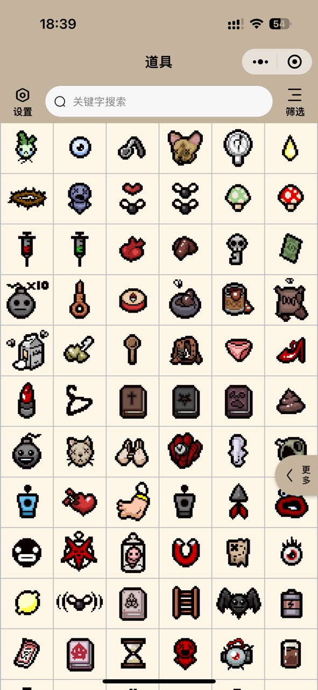
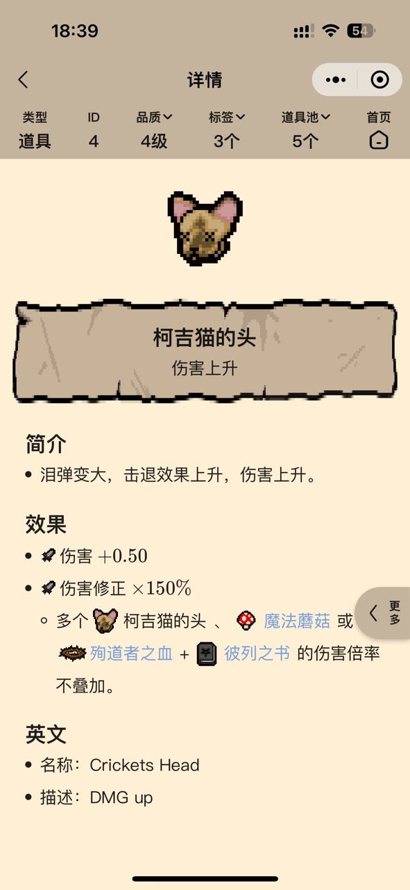
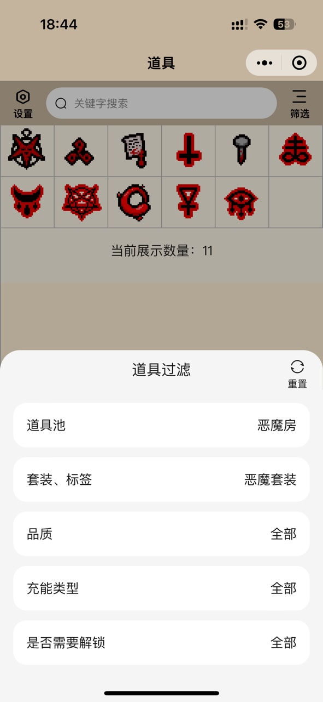

# Isaac Handbook

移动端以撒图鉴，专注于移动便携体验。数据主要来源于：[以撒的结合中文维基](https://isaac.huijiwiki.com/wiki/%E9%A6%96%E9%A1%B5)

微信小程序《以撒图鉴无敌版》

<table>
  <tr>
    <td></td>
    <td></td>
    <td></td>
  </tr>
 </table>

## 开发

```bash
# 安装依赖
npm install

# 运行项目
npm run dev
```

## 声明
本项目以个人学习、方便玩家为目的而创建，不作任何商业用途。

本项目遵从 [MIT协议](./LICENSE) 进行开源，欢迎大家提出建议和意见，或一起参与建设。
